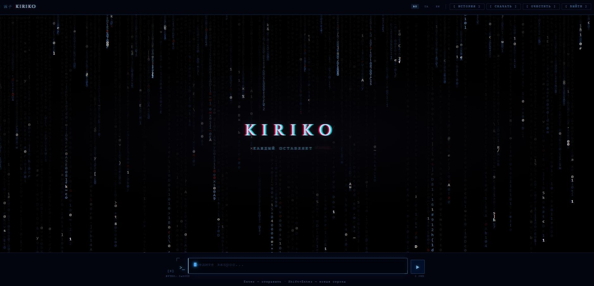
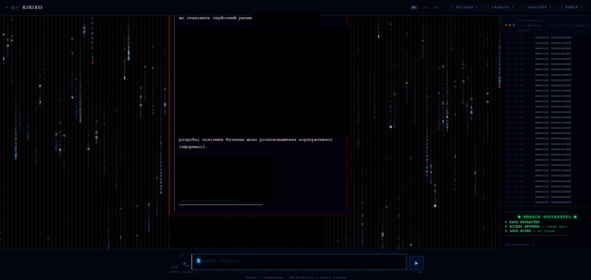
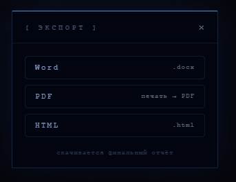

# 霧子 KIRIKO

> *"Fog leaves a trace."*

**KIRIKO** is a closed AI-powered OSINT platform built on Claude AI with Telegram bot integration. Designed for deep background checks with a minimal, cyber-noir Japanese aesthetic interface.

---

## Screenshots

<p align="center">
  
</p>

<p align="center">
  
</p>

<p align="center">
  
  &nbsp;&nbsp;
  
</p>

---

## Features

- **Autonomous AI agent** powered by Claude — runs the full verification cycle independently
- **OSINT tools** via Telegram: deep database lookups, social media search, phone lookup
- **ThunderTrace** — username search across 350+ platforms simultaneously
- **FanStatistik** — full Telegram account history: all usernames and display names
- **Report export** to Word (.docx), PDF, HTML
- **Matrix-style UI** with glitch effects and live character rain
- **Multilingual** — EN / UA / RU
- **Session history** with downloadable reports

---

## Stack

| Layer | Technology |
|-------|-----------|
| Backend | Python 3.12, Flask |
| AI Engine | Anthropic Claude API |
| Telegram | Telethon (MTProto) |
| PDF parsing | PyMuPDF |
| Doc export | python-docx |
| Frontend | Vanilla JS, CSS3 |

---

## Installation

### 1. Clone

```bash
git clone https://github.com/SiLiN-ua/kiriko.git
cd kiriko
```

### 2. Virtual environment

```bash
python -m venv venv
source venv/bin/activate  # Windows: venv\Scripts\activate
pip install -r requirements.txt
```

### 3. Configure

```bash
cp .env.example .env
```

Fill in `.env` with your credentials:

```env
ANTHROPIC_API_KEY=...
TG_API_ID=...
TG_API_HASH=...
TG_PHONE=+380XXXXXXXXX
TG_BOT_NEMEZIDA=...
TG_BOT_SHERLOCK=...
TG_BOT_FANSTATISTIK=...
APP_PASSWORD=...
```

### 4. Create Telegram session

```bash
python make_session.py
```

### 5. Run

```bash
python app.py
```

Open `http://127.0.0.1:5001`

---

## Project Structure

```
kiriko/
├── app.py                  # Flask entrypoint
├── core/
│   ├── agent.py            # Claude AI agent & system prompt
│   └── tools.py            # Tool wrappers (Telegram, ThunderTrace)
├── thundertrace/           # Username checker across 350+ platforms
├── templates/
│   ├── splash.html         # Entry screen
│   └── chat.html           # Main interface
├── static/
│   └── reports/            # Generated PDF reports (gitignored)
├── data/                   # Session & history (gitignored)
├── .env.example
└── requirements.txt
```

---

## Security

- Platform is password-protected (`APP_PASSWORD` in `.env`)
- Telegram session is stored locally and never transmitted
- All reports are generated and stored on your own server only
- `.env` and `data/` are excluded from git

---

## Author

**[Yehor Selin](https://github.com/SiLiN-ua)** — Developer & OSINT Analyst

---

<p align="center">
  <sub>霧子 — fog leaves a trace</sub>
</p>
